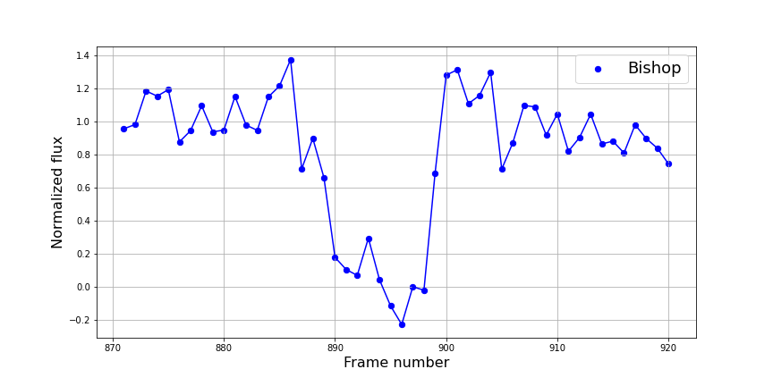

# Lucy Occultations

This repository contains a set of notebooks designed to help students better 
understand the [stellar occultation](http://lucy.swri.edu/occ/20230204Polymele.html) 
by the Jupiter Trojan Polymele that took place on Feb 4, 2023. Polymele is a [target](http://lucy.swri.edu/mission/Targets.html) of 
NASA's Lucy spacecraft, which will fly by it on September 15, 2027.

1. [Where is My Asteroid? How to Compute Ephemerides](Notebooks/Asteroid_Ephemerides.ipynb)
2. [Introduction to Solar System Dynamics](Notebooks/Intro_to_Solar_System_Dynamics.ipynb)
3. [Dynamics of Jupiter Trojans](Notebooks/Dynamics_of_Jupiter_Trojans.ipynb)
4. [Reducing Image Data](https://github.com/dwgerdes/LucyOcc/blob/main/Notebooks/Reducing%20Image%20Data.ipynb)
5. [Ride Along with Lucy!](https://github.com/dwgerdes/LucyOcc/blob/main/Notebooks/Ride_along_with_Lucy!.ipynb)
